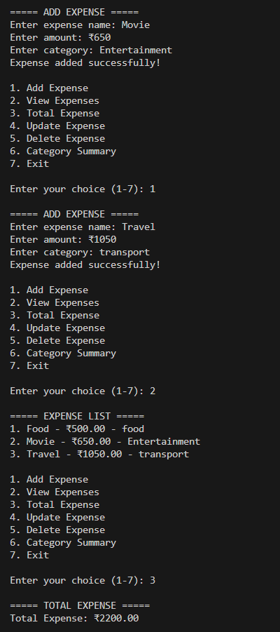
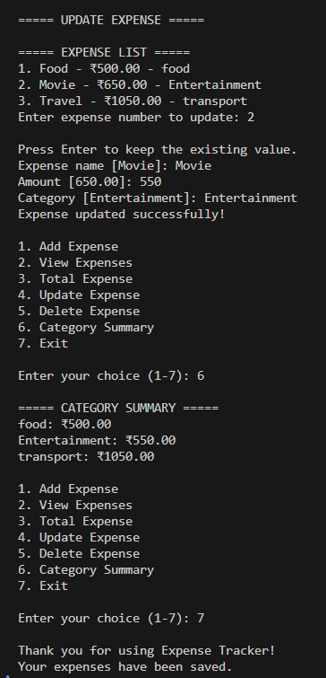

# 💰 Expense Tracker

A Python-based Expense Tracker that helps users manage their daily expenses efficiently.

## 📌 About the Project

This project is a console-based Expense Tracker developed using Python.

It allows users to add, view, update, and delete expenses, calculate total spending, and view expenses based on categories.

Expense data is stored locally using a JSON file so that the data can be available when the application is run again.

## ✨ Features

* ➕ Add new expenses
* 📋 View all expenses
* 💰 Calculate total expenses
* ✏️ Update existing expenses
* 🗑️ Delete expenses
* 📊 View category-wise expense summary
* ✅ Input validation
* 💾 Save expense data using JSON
* 🔄 Load saved expenses when the application starts

## 🛠️ Technologies Used

* Python
* JSON
* File Handling
* Exception Handling
* Functions
* Lists
* Dictionaries

## 📂 Project Structure

```text
expense-tracker/
│
├── expense_tracker.py
├── README.md
└── .gitignore
```

## ▶️ How to Run

### 1. Clone the repository

```bash
git clone https://github.com/BHARATHCHANDU06/expense-tracker.git
```

### 2. Open the project folder

```bash
cd expense-tracker
```

### 3. Run the program

```bash
python expense_tracker.py
```

## 🖥️ Main Menu

```text
1. Add Expense
2. View Expenses
3. Total Expense
4. Update Expense
5. Delete Expense
6. Category Summary
7. Exit
```

## 🔐 Data Privacy

Expense data is stored locally in `expenses.json`.

The `expenses.json` file is excluded from GitHub using `.gitignore` to prevent personal expense information from being uploaded.

## 🚀 Future Improvements

* Add a graphical user interface using Tkinter
* Add SQLite database support
* Add monthly and yearly reports
* Add data visualization
* Build a REST API using FastAPI
* Add PostgreSQL database support
* Add user authentication
## 📸 Screenshots

### Expense Tracker Demo



### Category Summary


